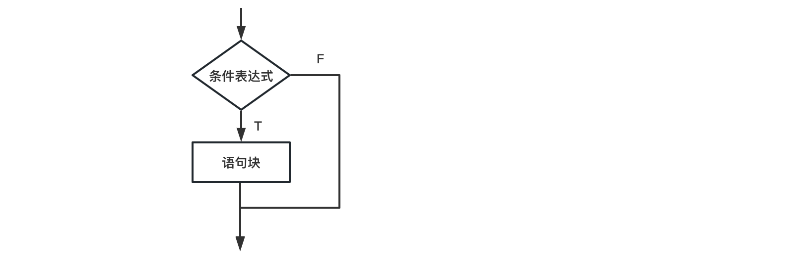

# Big-Data-in-Finance
 《大数据金融》课程的授课课件（含作业）
版本号：V1.02
更新日期：2023.5.9

## 本课件的特点
- 课上练习多，且容易上手。每一个知识点均搭配一个练习，帮助学生迅速巩固对于知识点的理解。
- 课后作业场景丰富，具有挑战性。增加了较多商业场景，避免编程知识和商业场景脱离。
- 图片多，示例多。大部分知识点应用可视化的方式，降低学习难度。

## 课件目录
- 作业答案
  - 作业答案-第2章 Python基本知识.ipynb
  - 作业答案-第3章 Numpy.ipynb
  - 作业答案-第4章 Pandas.ipynb
  - 作业答案-第5章 matplotlib.ipynb
- 第1章_金融大数据引言
  - 1.1 大数据的概念.ipynb
  - 1.2 金融大数据的概念.ipynb
  - 1.3 Python介绍.ipynb
  - 附录-latex语法.ipynb
  - 附录-markdown语言.ipynb
  - 附录-为什么学习编程和Python.ipynb
  - 附录-为什么我输入慢.ipynb
  - 附录-解决jupyterlab浏览器无法跳转问题.pdf
  - 附录_Jupyter介绍.ipynb
- 第2章_Python基本知识
  - 1 数据类型.ipynb
  - 2 流程控制.ipynb
  - 3 函数与模块.ipynb
  - 作业.ipynb
  - 练习答案.ipynb
  - 附录-函数的参数.ipynb
  - 附录-更多练习与答案
  - 附录-输入输出
  - 附录-面向对象
- 第3章_Numpy科学计算包
  - 3.1 Numpy介绍.ipynb
  - 3.2 Numpy的一维数组.ipynb
  - 3.3 Numpy的二维数组.ipynb
  - 3.4 Numpy的应用.ipynb
  - 作业.ipynb
  - 练习答案.ipynb
  - 附录：Array programming with NumPy.pdf
  - 附录：help以及文档帮助.ipynb
- 第4章_Pandas数据分析包
  - 4.1 Pandas介绍.ipynb
  - 4.2 Pandas的数据框.ipynb
  - 4.3 描述性统计方法.ipynb
  - 作业.ipynb
  - 附录： DataFrame详细方法.ipynb
  - 附录： Series详细方法.ipynb
  - 附录：Pandas-Cheat-Sheet.pdf
  - 附录：Pandas官方文档.pdf
- 第5章_Matplotlib绘图包
  - 5.1 可视化入门.ipynb
  - 5.2 matplotlib入门.ipynb
  - 作业.ipynb
  - 附录：matplotlib cheetsheet.pdf
  - 附录：matplotlib手册.pdf
  - 附录：中文无法正常显示的问题.ipynb
  - 附录：折线图.ipynb
  - 附录：散点图.ipynb
  - 附录：直方图和柱状图.ipynb
  - 附录：箱线图.ipynb
  - 附录：饼图.ipynb
- 第6章_数据源处理
  - 6.1 数据源.ipynb
  - 6.2 网页爬虫.ipynb
  - 6.3 数据预处理.ipynb
  - 作业.ipynb
  - 附录：用Python写网络爬虫.pdf
- 第7章_文本挖掘
  - Untitled.ipynb
- 第8章_机器学习模型
  - 6.1_机器学习导论
  - 6.2_线性回归
  - 6.3_决策树
  - 6.4_聚类
  - 6.5_神经网络

## 部分课件示例
if 语句单分支结构的语法形式为：
```python
if(条件表达式):
    语句块
```


简单随机划分（Simple Random Sampling）：将原始数据集随机划分为训练集和测试集两部分，通常将数据集的 70% 到 80% 作为训练集，剩余部分作为测试集。

